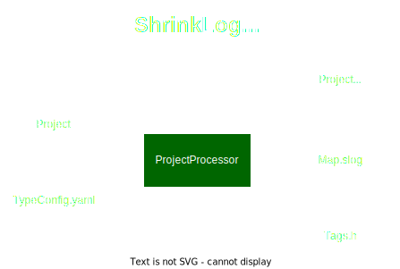
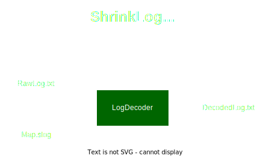

# What is ShrinkLog?
ShrinkLog is a set of tools designed to enable logging on small targets, such as microcontrollers. 
Its main features include:
* reducing the footprint of log messages in non-volatile memory
* minimizing the footprint of the printf function in non-volatile memory
* lowering the overhead of printf-like formatting during runtime
* reducing the size of messages sent through interfaces like UART

### Example without ShrinkLog
Consider the following example log:
```c++
printf("This is an example log printing a number %hd\n", 1234);
```

This log requires putting a message in memory: ```This is an example log printing a number %hd\n.``` 
It then converts the argument from int to string. 
Finally, it sends the message through an interface: ```This is an example log printing a number 1234.```

Using such logs brings following issues:
* Storage: The example message string will consume 45 bytes of non-volatile memory. So, if you have 100 similar logs, you'd need over 4kB of space.
* Storage (again): The printf function is memory-intensive and can consume a significant amount of non-volatile bytes.
* CPU cycles: The printf function needs to transform the number 1234 into a string, involving operations like modulo and division. On simple architectures, this process requires tens or even hundreds of CPU clock cycles.
* Interface time: Finally, the code has to send 46 bytes through the interface. If you're using a 112500-baud UART, it would take 427 microseconds. This might not be a problem for one log, but if you have 1000 logs, it would take almost half a second to send them all.

### Example with ShrinkLog 
When using ShinkLog, the log function would look like below:
```c++
LOG(SLOG_jI3O7Y4, "This is an example log printing a number %hd\n", 1234);
```
* The message is stored in the memory as: ```0x01 0x02 0x00```. 3 bytes instead of 45.
* It sends arguments using raw binary format - no expensive conversion to string is required.
* It resembles the printf function and supports **almost all printf features**, including floats, size modifiers, paddings, and precision. 
Its memory footprint is minimal. 
* The *SLOG_jI3O7Y4* serves as a tag, and users don't need to modify or manage it.
* The log is sent through the interface as: ```0104d20a```. 8 bytes instead of 46.
    > **_NOTE:_**  This is the so-called text mode (where bytes are sent in text hex format). The Binary mode feature is currently in preparation and will reduce the message sent through the interface by half.
  
# How to install ShrinkLog?
1. **Install Docker**

   To make ShrinkLog as portable and simple to install as possible both build and execution happens inside a docker container. However, you do not need to know much about Docker. All steps are covered by pre-prepared scripts. Your local filesystem will be mounted inside the container so no files need to be moved.
   <br><br>
   Currently, ShrinkLog was tested on Windows (WSL2) and Linux (Ubuntu).
   > **(Windows only) Install WSL2** <br>
   > * All required steps to install a WSL2 Linux are explained here: https://learn.microsoft.com/en-us/windows/wsl/install \
   > * Recomended distribution is Ubuntu or Debian.
   > * From WSL terminal perspective your windows drives will be mounted to ```/mnt/<your drive letter>``` by default. For example ```/mnt/c```.

   Install Docker on your system using official instruction https://docs.docker.com/engine/install/.
   > **NOTE**
   >* Sometimes the docker deamon need to be run manually or configured to start automatically.
   >   * On Windows always start Docker Desktop before using ShrinkLog.
   >   * On Linux make sure the demon starts with the OS https://docs.docker.com/config/daemon/start/.

   > **(Windows only) Execute all the next steps inside WSL2 Linux terminal**
1. **Clone ShrinkLog to selected directory**
   ```shell
   git clone https://github.com/RafalBanaszak/ShrinkLog.git
   cd ShrinkLog
   ```
1. **Run the installation script**

   Make sure you are in ShrinkLog directory **(important)** and execute the installation script:
   ```shell
   ./Scripts/Install.sh
   ```
   The script will:
   * build a docker image
   * build ShrinkLog using the docker image
   * build and execute ExampleProject using the docker image
   
   You can check results of the ExampleProject:
   * Open and review the ExampleProject/main.c file. It contains both a demo and some tests.
   * Open the logRaw.txt file and examine its contents. This file contains encoded demo logs.
   * Open the logDecoded.txt file and examine its contents.

# How ShrinkLog works?
## ProjectProcessor
The ProjectProcessor is a tool that processes the source code of the project. It performs the following steps:
1. Checks all the project files and finds *LOG* functions. 
1. Analyzes messages and their arguments. Every log is encoded as a special sequence which will instruct the *LOG* function during runtime how to send a log.
1. For every special sequence a new tag is generated. The old tags inside *LOG* functions are replaced with the new generated tags (only when a message changed).
1. The ProjectProcessor generates a header file with all the tags and their corresponding special sequences.
1. The ProjectProcessor generates a map file which is used by the LogDecoder to decode the raw logs.

To encode the logs properly additional file called TypeConfig.yaml is required. It contains information about types sizes at the target platform, endianness etc.
The file must be generated only once. The TargetLib (part of the ShrinkLog) provides a function to generate such file.

<div style="text-align:center;">
  
</div>

## LogDecoder
The LogDecoder is a tool that decodes logs. It performs the following steps:
1. Reads the map file generated by the ProjectProcessor.
1. Reads the (raw) log file and decodes logs using the map file.
1. The decoded logs appears in the standard output. Typical use case assumes redirection to a file (chart).

<div style="text-align:center;">
  
</div>

## TargetLib
TargetLib is a library that provides runtime functions like the *LOG* function.
```ShrinkLog.h``` is the only file that must be included to use ShrinkLog.
The *slog* directory should be copied to the **root** directory of the project.
It will contain both ShrinkLog.h header and all supporting files (map, typeconfig etc.).
To use the TargetLib the user must also implement the ```void SlogPutchar(char byte)``` function.

# How to use ShrinkLog in your project?
> **_NOTE:_**  In case of any doubts, please refer to the ExampleProject.

1. **Prepare your project**

   Prepare a minimal project that is able to send a single byte through an interface. 
   Write the ```void SlogPutchar(char byte)``` function. 
   Its purpose is to get a byte (ASCII character) and send it through an interface (e.g. UART).
   Test your interface. Send a single character (e.g. 'A') and make sure you are able to receive that character at your host machine.
   <br><br>
   - [ ] SlogPutchar function implemented
   - [ ] Interface monitor received the test character
     <br><br>
1. **Add TargetLib to your project**

   Copy the ```TargetLib/slog``` to the **root** directory of the project (only the *slog* directory like MyProject/**slog**).
   <br><br>
   - [ ] slog directory copied to the project
   <br><br>
1. **Generate TypeConfig.yaml**

   The TypeConfig.yaml file contains information about types sizes at the target platform, endianness etc.
   The file must be generated only once. The TargetLib (part of the ShrinkLog) provides a function to generate such file.
   1. Copy the ```TargetLib/TypeConfigs/TypeSizeDiscovery.h``` to slog directory and include it in your project.
   1. Call the ```void SlogGenerateTypeConfig(void)``` function once. It should send the TypeConfig.yaml file content through the interface.
   1. Put the TypeConfig.yaml file in the slog directory.
   <br><br>
   - [ ] TypeConfig.yaml file generated
   - [ ] TypeConfig.yaml file copied to the slog directory
     <br><br>
1. **Write test log**
   
   Write a simple log and test it. For example:
   ```c++
    LOG(SLOG_unknown, "This is an example log printing a number %hd\n", 1234);
    ```
   The tag ```SLOG_unknown``` will be replaced with a new tag during the ProjectProcessor step. The tag **must** start with ```SLOG_``` and must
   contain 7 characters. Valid characters are: ```[a-z] [A-Z] [0-9] - _```.
   > **_NOTE:_**  At this stage the project won't compile. The ProjectProcessor must be run first (next step).
   
   - [ ] LOG function used in the project
   - [ ] The code execution can reach the LOG function
     <br><br>
1. **Run the ProjectProcessor and compile the project**

   Run the ProjectProcessor on your project. Call the ```./Scripts/ProjectProcessor.sh``` script with a project path as the first argument like:
    ```shell
    ./ShrinkLog/Scripts/ProjectProcessor.sh /mnt/c/MyProject
    ```
   Next compile the project.
   <br><br>
   - [ ] Script executed with result SUCCESS
   - [ ] Tags.h file is in the slog directory and isn't empty
   - [ ] Map.slog file is in the slog directory and isn't empty
   - [ ] Project compiles
   <br><br>
1. **Collect the log**

   Run the project and collect the log to a text file.
   <br><br>
   - [ ] Text file with raw log is collected
     <br><br>
1. **Decode the log**
   
   Run the LogDecoder on the collected log. Call the ```./Scripts/LogDecoder.sh``` script with a map file path as 
   the first argument, a log file path as the second argument like and a result file path as the third argument like:
    ```shell
    ./ShrinkLog/Scripts/LogDecoder.sh /mnt/c/MyProject/slog/Map.slog /mnt/c/MyProject/logRaw.txt /mnt/c/MyProject/logDecoded.txt
    ```

   - [ ] LogDecoder executed with result SUCCESS
   - [ ] LogDecoded.txt file is in the project directory and its content is valid
   <br><br>

# Tips and tradeoffs 


